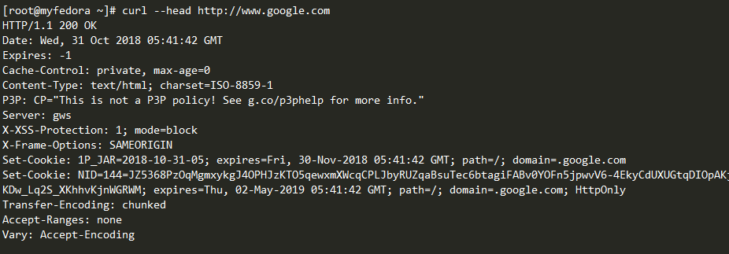
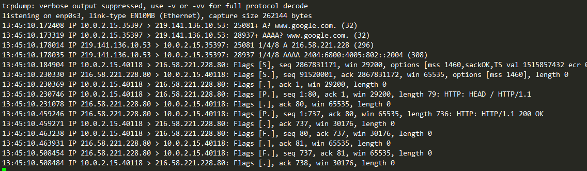
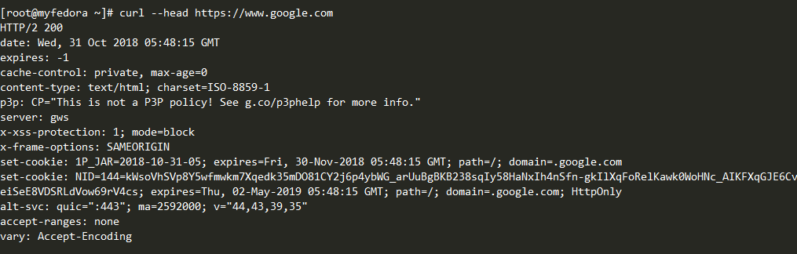
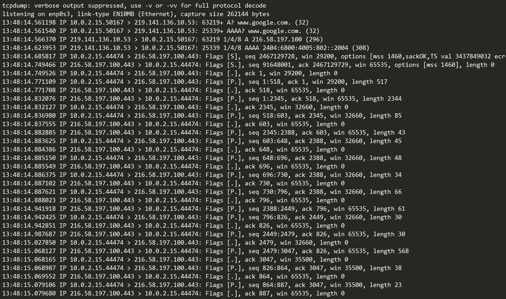
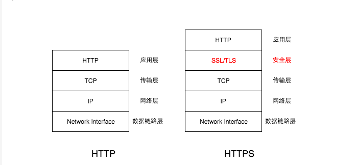
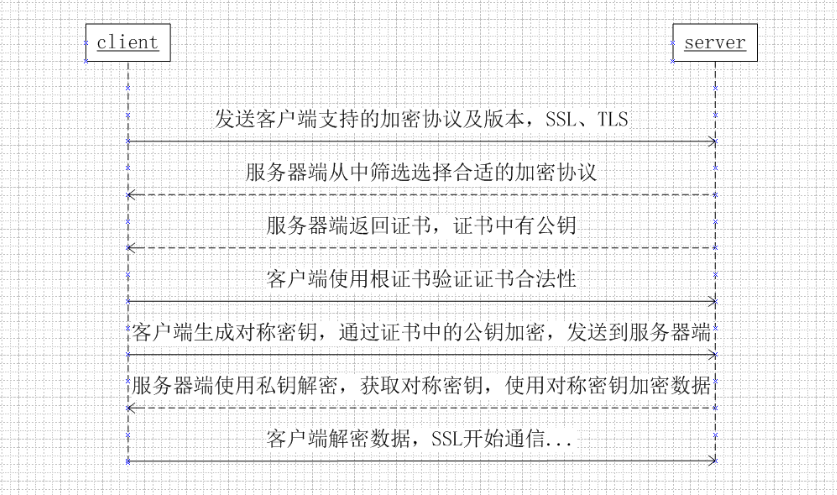

### 什么是HTTPS?
HTTPS 是HTTP协议的安全版本，HTTP协议(超文本传输协议)是在浏览器和连接的网站之间发送数据的协议。HTTPS末尾的S代表的是安全的意思。这意味着浏览器和网站之间的所有通信都是加密的。HTTPS通常用于保护机密的在线交易，例如网上银行和在线购物等。  

Internet Explorer，Firefox和Chrome等web浏览器会在地址栏显示挂锁的图标来显示HTTPS连接有效。  

  
 

### HTTPS有什么作用?
正确配置后HTTPS连接可以保证三件事:
- 保密性。 访问者的连接已经加密，隐藏了URL，Cookie和其他敏感的元数据
- 真实性。 访问者确定访问的真实的网站，而不是模仿的网站或者是中间人
- 完整性。 访问者和网站之间发送的数据没有被修改或者篡改  
一个HTTPS的请求会使你无法完整的查看报文头部的信息.  

### HTTPS安全在哪些部分?
使用curl命令分别进行抓包分析:  
(使用curl命令而不使用浏览器，是因为谷歌默认浏览器访问都为https请求的)
对比访问https://www.google.com 和 http://www.google.com  

curl --head http://www.google.com  

  
 

  
 

curl --head https://www.google.com  

  
 

  
 

从上面几张图片可以看到使用curl命令访问http网站和https网站是两种不同的报文，其中http方式访问网站使用head方法，
会直接返回相关的http response 报文，并且使用tcpdump会看到相关的http请求报文和响应报文内容。而使用https方式访问
网站时，在www.google.com，显示的http协议为http/2，并且使用tcpdump看不到相关的请求报文和响应报文的内容。  
由此可以看见https在一定程度上确实是比http安全的。  

虽然HTTPS会加密整个HTTP请求和响应，但是从tcpdump中抓到的封包中依然可以看到DNS解析等。以及网站的原始IP等信息。

### HTTPS是怎么工作的?
HTTPS协议是在原有的HTTP协议中再封装一层SSL/TLS协议，在HTTP之下TCP之上增加SSL/TLS协议实现HTTP的加密通信。  

  
 

#### 什么是SSL/TLS协议?
SSL 即 安全套接字层（Secure Socket Layer），是 Netscape 公司研发，通过数据加密技术来保障互联网上数据传输的
安全性。现已被广泛地用于 Web 浏览器与服务器之间的身份认证和加密数据传输。SSL 位于 TCP/IP 协议和各种应用层
协议之间，由 SSL 记录协议 和 SSL 握手协议 两层组成。目前版本为 3.0。
TLS 即 传输层安全协议（Transfer Layer Security）用于两个应用程序之间提供保密性和数据完整性。该协议
由两层组成：TLS 记录协议和 TLS 握手协议。  

#### SSL和TLS的关系和历史?
互联网加密通信协议的历史，几乎与互联网一样长。  

	1994年，NetScape公司设计了SSL协议（Secure Sockets Layer）的1.0版，但是未发布。  
	1995年，NetScape公司发布SSL 2.0版，很快发现有严重漏洞。  
	1996年，SSL 3.0版问世，得到大规模应用。  
	1999年，互联网标准化组织ISOC接替NetScape公司，发布了SSL的升级版TLS 1.0版。  
	2006年和2008年，TLS进行了两次升级，分别为TLS 1.1版和TLS 1.2版。  
	最新的变动是2011年TLS 1.2的修订版。  
	目前，应用最广泛的是TLS 1.0，接下来是SSL 3.0。  
	但是，主流浏览器都已经实现了TLS 1.2的支持。  
	TLS 1.0通常被标示为SSL 3.1，  
	TLS 1.1为SSL 3.2，  
	TLS 1.2为SSL 3.3。  

#### SSL/TLS基本运行过程?
SSL/TLS协议的基本思路是采用公钥加密法，也就是说，客户端先向服务器端索要公钥，然后用公钥加密信息，
服务器收到密文后，用自己的私钥解密。  
但是，这里有两个问题:  

	（1）如何保证公钥不被篡改？  
		解决方法：将公钥放在数字证书中。只要证书是可信的，公钥就是可信的。  
	（2）公钥加密计算量太大，如何减少耗用的时间？  
		解决方法：每一次对话（session），客户端和服务器端都生成一个"对话密钥"（session key），用它来加密信息。  
		由于"对话密钥"是对称加密，所以运算速度非常快，而服务器公钥只用于加密"对话密钥"本身，这样就减少了加密运算的消耗时间。  

因此，SSL/TLS协议的基本过程是这样的：  

	（1） 客户端向服务器端索要并验证公钥。  
	（2） 双方协商生成"对话密钥"。  
	（3） 双方采用"对话密钥"进行加密通信。  

上面过程的前两步，又称为"握手阶段"（handshake）。  

### SSL证书?
SSL 证书是一种数字证书，它是由 数字证书认证机构（Certificate Authority, CA） 颁发的，通常是一个很小的数据文件，
这个文件将 密钥 和 组织（使用证书的组织或个人）的相应信息 绑定在一起。SSL证书需要安装在服务器上来激活 HTTPS 协议，从而允许服务器和浏览器之间的安全连接。  
SSL/TSL协议中将公钥放在数字证书中。这个证书就是CA证书。这涉及到相关的加密方式。如果需要了解可以查看我的另一篇Blog。
[相关加密方式](https://github.com/ihuangch/blog/issues/7)  

### 访问一个HTTPS网站具体需要的步骤?  

	0.客户端3次握手建立tcp连接。
	1.客户端请求建立https连接，并将自己支持的一套加密规则发送给网站。(client hello)
		随机数：里面有1970年1月1日到现在的秒数，后面还有一个客户端发来的随机数Client.random
		Session ID：如果客户端与服务器费尽周折建立了一个HTTPS链接，刚建完就断了，也太可惜，
					所以用Session ID将其保存，如果下次再来可以直接使用之前的链接进行对话(对称密钥)。
		密文族：告诉服务器，自己支持的加密算法种类
		Server_name
	2.服务器返回(server hello)
		随机数：对应服务器时间，服务器sever.random
		Seesion ID：如果客户端发给服务器的session ID在服务端有缓存，服务端会尝试使用这个session；否则服务器会启用新的并返回给客户端；
		服务器挑选一个密文族
	3.服务器发来证书
		服务器发来我们想要的数字证书，包含了：签发机构、过期时间、主题名称、公共密钥信息、指纹信息等等
	4.客户端验证
		客户端从内置的CA根证书获取C.pub，对服务器发送来的数字证书进行验签，如果一致，说明证书是CA颁发的
		（前提是C.pub是真实的，确实是CA机构的公钥）。然后看看证书是否过期，域名是否匹配
	5.生成对称密钥
		客户端根据之前的：Client.random + sever.random + pre-master生成对称密钥
		经过S.pub加密发送给服务器，之后即可通过对称密钥进行通讯。（就是之前我们熟悉的http）

  
 
		
在整个过程中，一共涉及2对公私密钥对，一对由服务器产生，主要用于加密，一对由CA产生，主要用于签名。
为什么要多一个CA呢？
假设没有CA，那么如果服务器返回的包含公钥的包被hack截取，然后hack也生成一对公私钥，他将自己的公钥发给客户端。
hack得到客户端数据后，解密，然后再通过服务器的公钥加密发给服务器，这样数据就被hack获取。
有了CA后，客户端根据内置的CA根证书，很容易识别出hack的公钥不合法，或者说hack的证书不合法。
